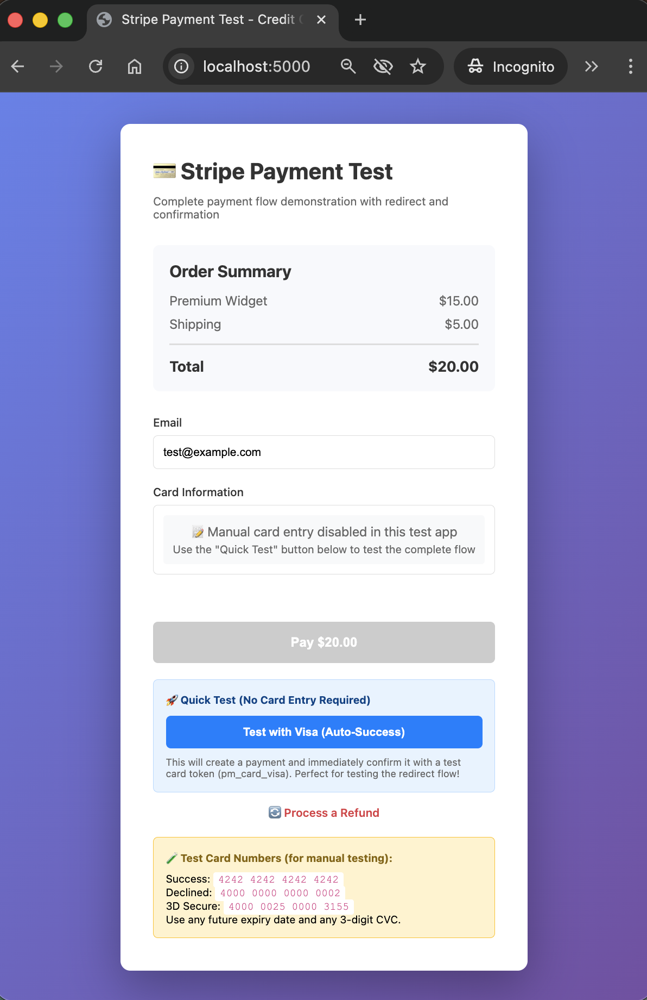
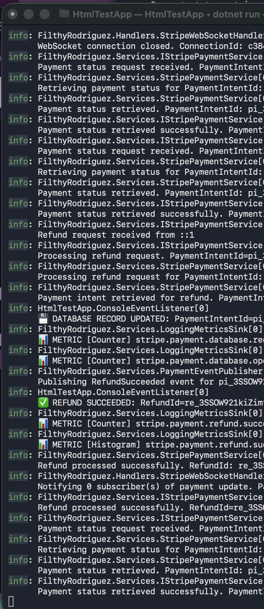
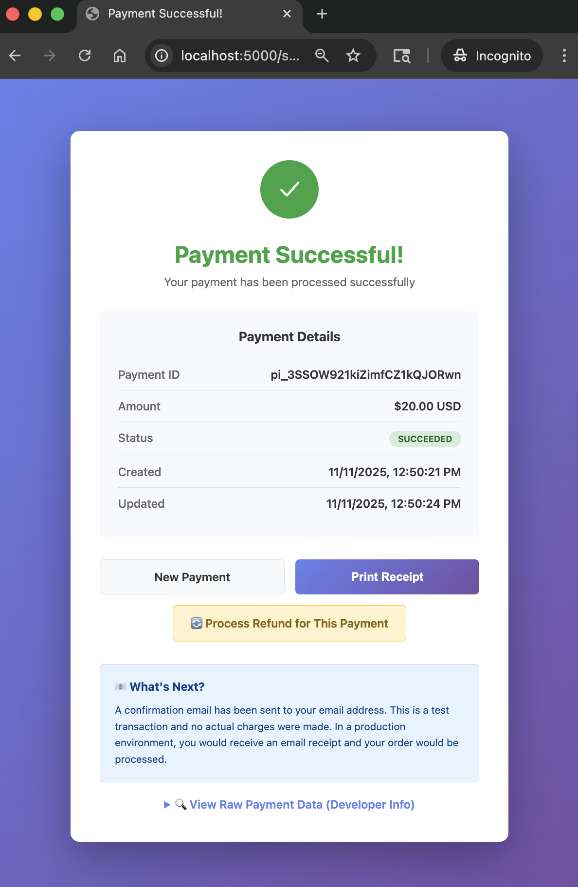
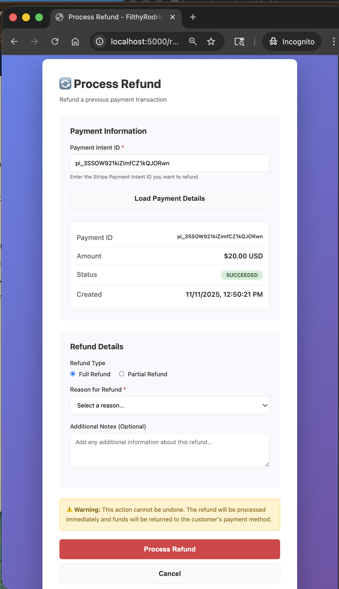

# FilthyRodriguez

> A drop-in, framework-agnostic Stripe payment plugin for .NET 8 applications

[](https://dotnet.microsoft.com/)
[](LICENSE)

## Overview

FilthyRodriguez is a **reusable .NET 8 library** that provides Stripe payment integration with a simple JSON-based API. It's designed to be framework-agnostic, easy to integrate, and requires minimal configuration to get started.

### Key Features

- 🎯 **Framework-agnostic** - JSON in/out, works with any .NET 8 application
- 🔄 **Automatic webhook handling** - Built-in Stripe webhook verification and processing
- 📡 **Real-time updates** - WebSocket support for instant payment status notifications
- 💾 **Optional database persistence** - Store transactions in SQL Server, PostgreSQL, MySQL, or SQLite
- ⚙️ **Simple configuration** - Configure via `appsettings.json`
- 🎨 **Multiple notification patterns** - Callback, EventHandler, or IStripeWebhookHandler interface
- 💸 **Full refund support** - Process full or partial refunds with metadata
- 🚀 **Production-ready** - 133 unit tests, comprehensive logging, error handling

## Live Demo

### Payment Flow

<table>
<tr>
<td width="50%">

**1. Payment Form**



Simple, responsive payment interface with amount input and Stripe Elements integration.

</td>
<td width="50%">

**2. Processing**



Real-time WebSocket updates show payment status as it processes through Stripe.

</td>
</tr>
<tr>
<td width="50%">

**3. Success Receipt**



Confirmation page displays transaction ID, amount, status, and timestamp with refund option.

</td>
<td width="50%">

**4. Refund Processing**



One-click refunds with full or partial amount support and instant status updates.

</td>
</tr>
</table>

> **Try it yourself**: Run `cd examples/HtmlTestApp && dotnet run` and open http://localhost:5000

## Quick Start

### 1. Add to Your Project

```bash
dotnet add reference path/to/FilthyRodriguez.csproj
```

### 2. Configure

Add your Stripe credentials to `appsettings.json`:

```json
{
  "FilthyRodriguez": {
    "ApiKey": "sk_test_your_stripe_api_key",
    "WebhookSecret": "whsec_your_webhook_secret"
  }
}
```

### 3. Setup in Program.cs

```csharp
using FilthyRodriguez.Extensions;

var builder = WebApplication.CreateBuilder(args);

// Add FilthyRodriguez
builder.Services.AddFilthyRodriguez(builder.Configuration);

var app = builder.Build();

// Enable WebSockets and map endpoints
app.UseWebSockets();
app.MapStripePaymentEndpoints("/api/stripe");
app.MapStripeWebSocket("/stripe/ws");

app.Run();
```

That's it! You now have a fully functional Stripe payment API.

## API Endpoints

Your application now has these endpoints:

- `POST /api/stripe/payment` - Create a payment intent
- `POST /api/stripe/confirm` - Confirm payment with test card (testing only)
- `GET /api/stripe/status/{id}` - Check payment status
- `POST /api/stripe/refund` - Process a refund (full or partial)
- `POST /api/stripe/webhook` - Stripe webhook endpoint (auto-configured)
- `GET /api/stripe/health` - Health check endpoint
- `WS /stripe/ws` - WebSocket for real-time payment updates

## Documentation

- **[API Documentation](docs/README.md)** - Complete API reference with examples
- **[Payment Events System](docs/EVENTS.md)** - Listen to payment lifecycle events
- **[Metrics System](docs/METRICS.md)** - Automatic metrics collection with pluggable sinks
- **[Database Guide](docs/DATABASE.md)** - Database configuration and field mapping
- **[SQLite Testing Guide](docs/SQLITE_TESTING.md)** - SQLite setup and testing

## Examples & Tools

### HTML Test App

Complete payment flow demonstration with UI:

```bash
cd examples/HtmlTestApp
dotnet run
# Open http://localhost:5000
```

Features payment form, WebSocket integration, success/cancel pages, and refund testing.  
[See HtmlTestApp README](examples/HtmlTestApp/README.md)

### API Tester

CLI tool for testing all API endpoints:

```bash
cd tools/ApiTester
dotnet run -- payment --amount 2000
dotnet run -- confirm --id pi_xxx --card 4242424242424242
dotnet run -- status --id pi_xxx
dotnet run -- refund --id pi_xxx
```

[See ApiTester README](tools/ApiTester/README.md)

### Webhook Test Subscriber

Test webhook notifications with formatted console output:

```bash
cd tools/WebhookTestSubscriber
dotnet run
# In another terminal: stripe listen --forward-to http://localhost:5000/api/stripe/webhook
```

[See WebhookTestSubscriber README](tools/WebhookTestSubscriber/README.md)

## Webhook Notification Patterns

FilthyRodriguez supports three flexible patterns for webhook notifications:

### 1. Callback (Simple)

```csharp
builder.Services.AddFilthyRodriguez(builder.Configuration)
    .WithWebhookCallback(async (paymentIntent, stripeEvent) =>
    {
        await _orderService.UpdateOrder(paymentIntent.Metadata["order_id"]);
    });
```

### 2. EventHandler (Standard .NET)

```csharp
public class PaymentService
{
    public PaymentService(IStripeWebhookNotifier notifier)
    {
        notifier.PaymentIntentSucceeded += OnPaymentSucceeded;
        notifier.PaymentIntentFailed += OnPaymentFailed;
    }
}
```

### 3. IStripeWebhookHandler (Advanced)

```csharp
public class OrderWebhookHandler : IStripeWebhookHandler
{
    public async Task HandlePaymentIntentSucceededAsync(PaymentIntent pi, Event evt)
    {
        await _orderService.CompleteOrder(pi.Metadata["order_id"]);
    }
}

// Register multiple handlers
builder.Services.AddSingleton<IStripeWebhookHandler, OrderWebhookHandler>();
builder.Services.AddSingleton<IStripeWebhookHandler, AnalyticsWebhookHandler>();
```

## Optional Database Persistence

> ✅ **Production Ready**: SQLite database persistence is fully tested and working. SQL Server, PostgreSQL, and MySQL support available.

Store transaction history with automatic schema creation and migration:

```csharp
builder.Services.AddFilthyRodriguez(builder.Configuration)
    .WithEntityFramework();
```

**Basic Configuration:**
```json
{
  "FilthyRodriguez": {
    "Database": {
      "Enabled": true,
      "Provider": "SQLite",
      "ConnectionString": "Data Source=payments.db"
    }
  }
}
```

**Features:**
- ✅ **SQLite** - Tested and working, perfect for development and small deployments
- ✅ **SQL Server** - Enterprise-grade transaction storage
- ✅ **PostgreSQL** - High-performance open-source option
- ✅ **MySQL** - Wide compatibility and support
- 🔧 **Automatic Schema** - Tables created on first run
- 📊 **Extended Data Capture** - Optional detailed transaction data (customer info, payment methods, refund tracking)

**Extended Data Capture (Optional):**

Set `CaptureExtendedData: true` to store additional transaction details:
- Customer ID and Email
- Payment Method Details (type, card brand, last 4)
- Financial Details (captured amount, refunds, application fees)
- Transaction Descriptions and Receipt Emails

```json
{
  "Database": {
    "Enabled": true,
    "Provider": "SQLite",
    "ConnectionString": "Data Source=payments.db",
    "CaptureExtendedData": true
  }
}
```

**Quick Test:**
```bash
cd examples/HtmlTestApp
ASPNETCORE_ENVIRONMENT=Sqlite dotnet run
# Process a payment, then query:
sqlite3 filthy_rodriguez_test.db "SELECT * FROM stripe_transactions;"
```

See [Database Guide](docs/DATABASE.md) and [SQLite Testing Guide](docs/SQLITE_TESTING.md) for complete details.

## Dependencies

### Core
- **Stripe.net** - Official Stripe SDK
- **Microsoft.AspNetCore.App** - ASP.NET Core framework

### Optional (Database)
- **Microsoft.EntityFrameworkCore** (8.0.0+)
- Database providers: SQL Server, PostgreSQL, MySQL, SQLite

## Requirements

- .NET 8 SDK
- Stripe account with test API keys

## License

This project is licensed under the MIT License - see the [LICENSE](LICENSE) file for details.

---

Made with ❤️ for the .NET community
